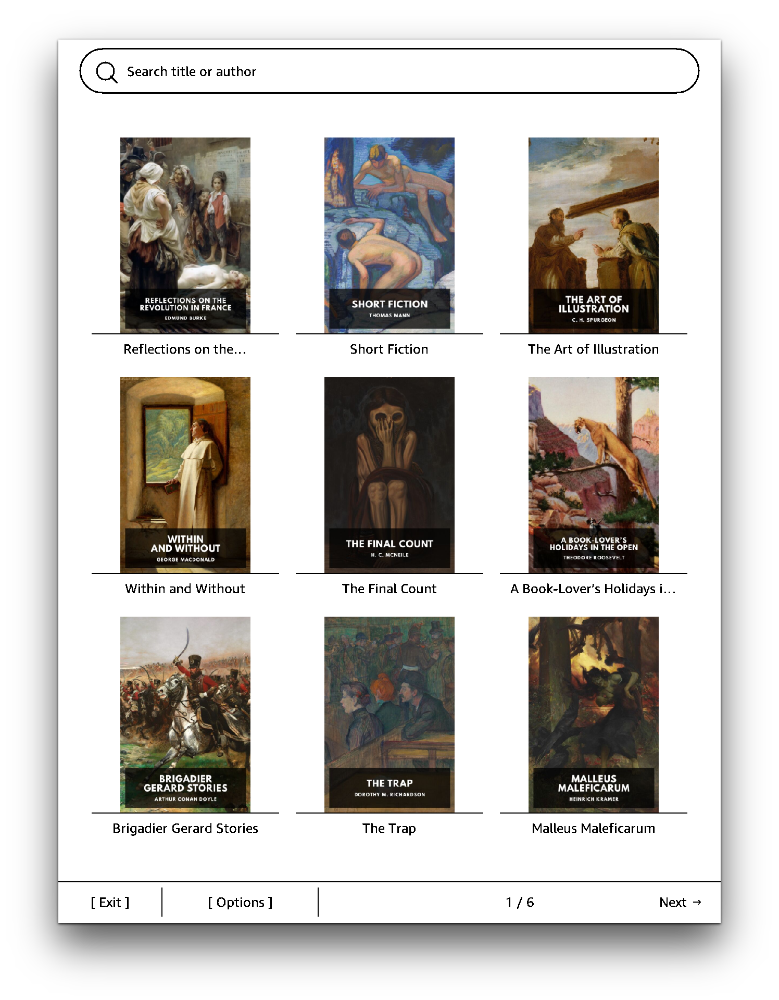
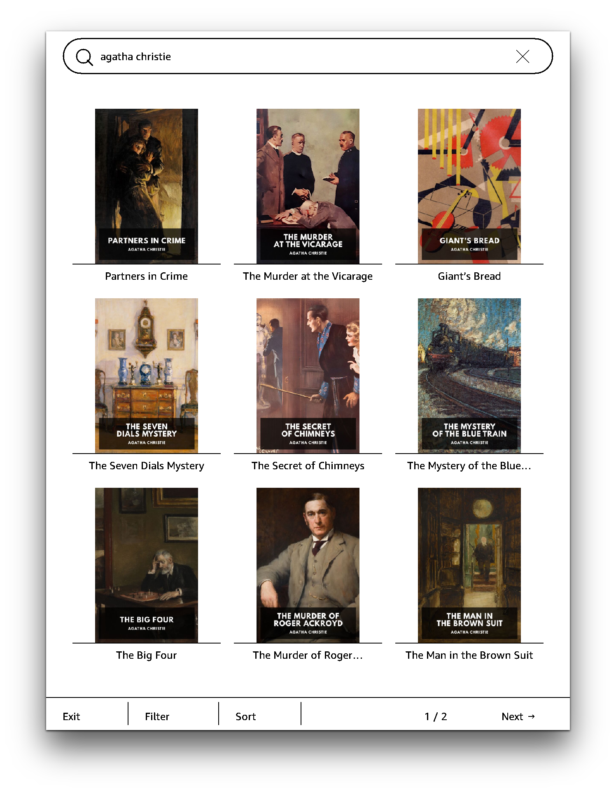

# Steb

Steb is an unofficial [Standard Ebooks](https://standardebooks.org) frontend on a jailbroken Kindle. 

Tested on Kindle Colorsoft (5.18.0.2).

## Build

```
git clone https://github.com/huangziwei/steb && cd steb/
./build.sh
```

## Install

Download and unzip the latest `steb-v<x.y.z>-kindle.zip` file from the [release page](https://github.com/huangziwei/steb/releases), then copy some files to your device:

| from | to | notes |
|:--|:--|:-- |
| `extensions/steb/` | `/mnt/us/extensions/steb/` | or anywhere you store your extensions |
| `documents/Steb.sh` | `/mnt/us/documents/Steb.sh` | or anywhere you store your scriptlets |

Optionally, download `bokai-v<x.y.z>-kindle.zip` from the [sidle releases](https://github.com/huangziwei/sidle/releases) and unzip it to `/mnt/us/extensions/bokai/`, then the `.azw3` files will be converted to `.kfx` automatically. This is particularly handy for Kindle Scribe, because KFX is the only format that supports handwritten annotations.

A local `./build.sh` stages the same two under `device/`.

## Screenshot

<p align="center">
    
    
</p>